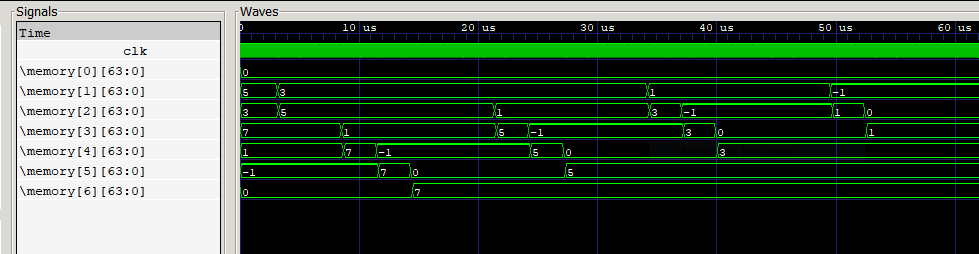

# tp03-3869-3872-3882

## Integrantes do grupo

1. Dener Vieira Ribeiro - 3872
2. Fábio Trindade Ramos - 3869
3. Guilherme Corrêa Melos - 3882

## Caminho de dados do RISC-V

Na imagem abaixo temos um vetor de números inteiros de 6 posições iniciando a partir da posição 1 da memória. Note que inicialmente os valores estão espalhados de forma aleatória (5, 3, 7, 1, -1, 0), mas por fim, estão ordenados em forma crescente (-1, 0, 1, 3, 5, 7).



## Documentação

Queer entender um pouco mais sobre como isso foi feito? Dê uma olhada aqui primeiro: [Documentação](https://www.overleaf.com/read/txffpzyxjzhy)

## Algoritmo utilizado no exemplo acima - Bubble Sort

Primeiro vamos relembrar a implementação do algoritmo

```c
int N = 6
int v[32];
int i, j, temp;

for(i=0; i<N; i++)
    for(j=0; j<N-1; j++)
        if(v[j] > v[j+1]) {
            temp = v[j];
            v[j] = v[j+1];
            v[j+1] = temp;
        }
```

Para converter esse belo código para assembly, utilizamos os seguintes registradores para as variáveis:

* N = x10
* v = x11
* i = x5
* j = x6

E esse aqui é o código em assemby do algoritmo utilizado, o Bubble Sort. Confira o final, tem informações importantes lá.

```asm
add x5, x0, x0
forOut:
    sub x7, x5, x10
    and x7, x7, x3
    beq x7, x0, exit
    add x6, x0, x0

forIn:
    sub x7, x10, x1
    sub x7, x6, x7
    and x7, x7, x3
    beq x7, x0, incrementOut
    
    add x28, x0, x6
    add x28, x28, x28
    add x28, x28, x28
    add x28, x28, x28
    add x28, x28, x11

    ld x29, 0(x28)
    ld x30, 8(x28)

    sub x7, x30, x29
    and x7, x7, x3
    beq x7, x0, incrementIn

    sd x30, 0(x28)
    sd x29, 8(x28)

incrementIn:
    add x6, x6, x1
    beq x0, x0, forIn
        
incrementOut:
    add x5, x5, x1
    beq x0, x0, forOut

exit:
    beq x0, x0, exit
```

### Observações

1. Nenhuma das instruções solicotadas nos permitia fazer operações com valores diretamente via código, então alguns valores precisaram ser inicializados nos registradores e memória para o bom funcionamento desse exemplo. Esses valores podem ser acessados por [aqui](./src/inputs).  

    * O registrador x1 deve ser inicializado com o valor 1.
    * O registrador x3 deve ser inicialixado com o valor (1<<63), o menor valor negativo em complemento de dois com 64 bits.
    * O registrador x10 deve ser inicializado com o valor de N.
    * O registrador x11 deve ser inicializado com o endereço base do vetor.
    * Adicione os valores na memória de dados.

2. Todos os testes realizados foram baseados no resultados obtidos no trabalho anterior, um montador assembly, voce pode acessa-lo pelo link [Montador RISC-V](https://github.com/oc-ufv/tp02-3869-3872-3882). Nesse diretório ainda existem outros exemplos de códigos testados nesse processador tais como um gerador da sequência de Fibonacci e um calculador de Fatorial. Assim como nesse exemplo, ambos precisam de configurações prévias de valor de alguns registradores.

    * Fibonacci: Cálculo do N-ésimo termo da sequência dada por:
        * F(0) = 0
        * F(1) = 1
        * F(N) = F(N-1) + F(N-2)

        O valor de N (N>=0) deve ser inicializado no registrador x28 e o resultado ficará gravado no registrador x7

    * Fatorial: Cálculo do Fatorial de N, dado pela fórmula:
        * Fat(0) = 1
        * Fat(N) = N * Fat(N-1)

        O valor de N (N>=0) deve ser inicializado no registrador x5 e o resultado ficará gravado no registrador x10
